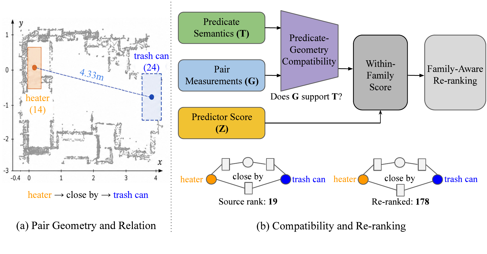
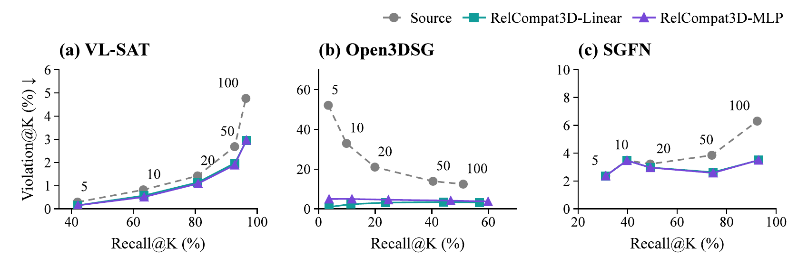

# RelCompat3D

RelCompat3D learns predicate--geometry compatibility and uses it to re-rank
fixed 3D scene graph relation predictions. The implementation covers model
fitting, family-aware re-ranking, controls, bootstrap evaluation, point/mesh
audits, and paper-table regeneration for VL-SAT, Open3DSG, and SGFN on 3DSSG.

### [Project Page](https://kim-yoo-hyun.github.io/RelCompat3D-Re-Ranking-3D-Scene-Graph-Relations-with-Geometric-Evidence/)



RelCompat3D estimates compatibility from predicate semantics and ordered-pair
geometry without the source relation score, then combines both signals during
family-aware re-ranking.

## Repository structure

```text
configs/       Pinned Docker environment and Compose services
experiments/   Frozen protocols and compact paper evidence
results/       Paper-facing result index
scripts/       Validation, model restoration, and experiment wrappers
site/          Static GitHub Pages project site
src/           Training, evaluation, audit, and table-generation code
```

Large datasets, source-predictor checkpoints, prediction rows, and trained
RelCompat3D parameter files are not stored in Git. Official sources and local
paths are specified below and in the README of the corresponding folder.

## 1. Setup

Docker is the canonical environment. The image uses Python 3.11.9 and the
fully pinned `requirements.lock.txt` environment.

```bash
git clone https://github.com/Kim-Yoo-Hyun/RelCompat3D-Re-Ranking-3D-Scene-Graph-Relations-with-Geometric-Evidence.git
cd RelCompat3D-Re-Ranking-3D-Scene-Graph-Relations-with-Geometric-Evidence
docker compose -f configs/relcompat3d/compose.yaml build relcompat3d_reproduce_rows
scripts/validate.sh
```

For local source inspection only:

```bash
python3.11 -m venv .venv
source .venv/bin/activate
pip install -r requirements.txt
python -m compileall -q src/relcompat3d
```

## 2. Restore RelCompat3D models

The lightweight fitted models are available [here](https://drive.google.com/file/d/1DaZoibKFyPS681e728Tzs613qscMgv4u/view).
The following command downloads the 36 KB archive, verifies its SHA-256
digest, and extracts the fitted models to their expected experiment paths.

```bash
scripts/download_models.sh
scripts/validate.sh --require-models
```

## 3. Prepare data and prediction rows

Obtain 3RScan/3DSSG and the source predictors from their official projects:

- [3RScan](https://github.com/WaldJohannaU/3RScan) and its
  [access page](https://waldjohannau.github.io/RIO/)
- [3DSSG](https://3dssg.github.io/)
- [VL-SAT](https://github.com/wz7in/CVPR2023-VLSAT)
- [SGFN/3DSSG](https://github.com/ShunChengWu/3DSSG)
- [Open3DSG](https://github.com/boschresearch/Open3DSG)

For Open3DSG, train the pinned official implementation with the provided
non-averaged BLIP configuration and select the checkpoint with the lowest
development loss:

```bash
scripts/train_open3dsg.sh prepare
scripts/train_open3dsg.sh preprocess
scripts/train_open3dsg.sh features
scripts/train_open3dsg.sh train
scripts/train_open3dsg.sh select
```

The source revision, data coverage gates, hyperparameters, and selection rule
are described [here](configs/open3dsg/README.md).

The repository does not redistribute licensed scans, meshes, annotations,
dataset-derived candidate rows, or third-party checkpoints. After obtaining
the official data and generating fixed predictions with the official source
predictor repositories, place the raw score dumps under
`local_dataset/RelCompat3D/source_outputs/` and run:

```bash
compose="docker compose -f configs/relcompat3d/compose.yaml"
env UID=$(id -u) GID=$(id -g) $compose run --rm relcompat3d_adapt_vlsat
env UID=$(id -u) GID=$(id -g) $compose run --rm relcompat3d_adapt_sgfn
env UID=$(id -u) GID=$(id -g) $compose run --rm relcompat3d_adapt_open3dsg
```

The raw schemas and output locations are described
[here](src/relcompat3d/README.md#source-prediction-adapters). Join the resulting
identity-preserving prediction rows with the officially obtained ordered-pair
geometry using the runtime layout described
[here](experiments/RelCompat3D_geom_reliability/README.md#data-and-runtime-layout).
Then create the local table rows with:

```bash
docker compose -f configs/relcompat3d/compose.yaml run --rm relcompat3d_export_rows
```

The resulting local intermediate belongs at:

```text
experiments/RelCompat3D_geom_reliability/paper_reproduction/artifacts/table_rows/
```

## 4. Reproduce Tables 1--3 and Figure 3

After creating the local table rows, run:

```bash
scripts/reproduce_tables.sh
```

Outputs are written to:

```text
experiments/RelCompat3D_geom_reliability/paper_reproduction/regenerated/
```

The command regenerates CSV and LaTeX versions of Tables 1--3, Figure 3 data
and renderings, and a cell-level comparison against 291 frozen paper values.
The accepted tolerance is `1e-12`; the frozen reference run has maximum
absolute error `0`.

## 5. Train and evaluate

The full RelCompat3D pipeline requires the licensed inputs described
[here](experiments/RelCompat3D_geom_reliability/README.md). Once those files
and the restored models are in place, run:

```bash
docker compose -f configs/relcompat3d/compose.yaml run --rm relcompat3d_fit
docker compose -f configs/relcompat3d/compose.yaml run --rm relcompat3d_freeze_initial
scripts/run_pipeline.sh initial
scripts/run_pipeline.sh downstream
```

Additional controls, robustness analyses, and recovery commands are listed
[here](experiments/RelCompat3D_geom_reliability/README.md#reproduction-commands).

## Results

Frozen compact outputs are tracked for inspection and integrity checks. The
main results are summarized below, and the complete artifact locations are
listed [here](results/README.md).

At `K=50`, the reported Recall/Violation percentages are:

| Predictor | Source | RelCompat3D-Linear | RelCompat3D-MLP |
| --- | ---: | ---: | ---: |
| VL-SAT | 92.72 / 2.68 | 92.77 / 1.97 | 92.72 / 1.89 |
| Open3DSG | 40.43 / 13.87 | 44.18 / 3.42 | 46.70 / 4.13 |
| SGFN | 74.02 / 3.85 | 74.50 / 2.63 | 74.57 / 2.58 |

These values use the scoped support/contact, proximity, and vertical-order
evaluation on the shared 3DSSG validation scenes.



## Reproducibility boundary

There are three supported levels:

1. A Git-only checkout validates code, configuration, protocols, and frozen
   results.
2. Git plus the public RelCompat3D model archive restores all learned
   compatibility parameters.
3. A Git checkout combined with officially obtained 3RScan/3DSSG data and
   outputs generated with the official source-predictor repositories supports
   local row export, paper-table regeneration, fitting, and evaluation.

Source-predictor inference remains governed by the upstream licenses and data
terms. VL-SAT and SGFN follow their official repositories. The Open3DSG
training configuration in this repository invokes the pinned official source
without redistributing its code or model files.

The repository does not provide a single command from raw dataset download
through inference of all three source predictors; data access and
source-predictor inference follow their official repositories.

## Citation

The paper citation will be added after publication. For the software release,
GitHub can read the metadata in [CITATION.cff](CITATION.cff).

## License

RelCompat3D code is released under the [Apache License 2.0](LICENSE). Dataset,
source-predictor, and checkpoint licenses remain with their respective owners;
see [third-party licenses](third_party_licenses.md).
