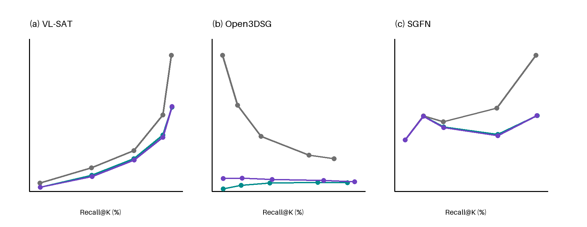

# RelCompat3D

RelCompat3D learns predicate--geometry compatibility and uses it to re-rank
fixed 3D scene graph relation predictions. The implementation covers model
fitting, family-aware re-ranking, controls, bootstrap evaluation, point/mesh
audits, and paper-table regeneration for VL-SAT, Open3DSG, and SGFN on 3DSSG.



## Repository structure

```text
configs/       Pinned Docker environment and Compose services
docs/          Data, model, result, and reproduction instructions
experiments/   Frozen protocols and compact paper evidence
results/       Paper-facing result index
scripts/       Validation, model restoration, and experiment wrappers
src/           Training, evaluation, audit, and table-generation code
```

Large datasets, source-predictor checkpoints, prediction rows, and trained
RelCompat3D parameter files are not stored in Git. Their sources and expected
paths are documented in [docs/data.md](docs/data.md) and
[docs/models.md](docs/models.md).

## 1. Setup

Docker is the canonical environment. The image uses Python 3.11.9 and the
fully pinned `requirements.lock.txt` environment.

```bash
git clone https://github.com/Kim-Yoo-Hyun/RelCompat3D.git
cd RelCompat3D
docker compose -f configs/relcompat3d/compose.yaml build relcompat3d_reproduce_rows
scripts/validate.sh
```

For local source inspection only:

```bash
python3.11 -m venv .venv
source .venv/bin/activate
pip install -r requirements.txt
python -m compileall -q src/relcompat3d
```

## 2. Restore RelCompat3D models

The lightweight fitted models are hosted separately on Google Drive. The
following command downloads the 36 KB archive, verifies its SHA-256 digest,
and extracts each JSON model to its expected experiment path.

```bash
scripts/download_models.sh
scripts/validate.sh --require-models
```

See [docs/models.md](docs/models.md) for the file list, model hashes, source
predictor links, and the Open3DSG checkpoint path.

## 3. Prepare data and prediction rows

Obtain 3RScan/3DSSG and the source predictors from their official projects:

- [3RScan](https://github.com/WaldJohannaU/3RScan) and its
  [access page](https://waldjohannau.github.io/RIO/)
- [3DSSG](https://3dssg.github.io/)
- [VL-SAT](https://github.com/wz7in/CVPR2023-VLSAT)
- [SGFN/3DSSG](https://github.com/ShunChengWu/3DSSG)
- [Open3DSG](https://github.com/boschresearch/Open3DSG)

The repository does not redistribute licensed scans, meshes, annotations,
dataset-derived candidate rows, or third-party checkpoints. Authorized users
can create the derived evaluation bundle with:

```bash
docker compose -f configs/relcompat3d/compose.yaml run --rm relcompat3d_export_rows
```

The required input layout and hashes are specified in
[docs/data.md](docs/data.md). The resulting bundle belongs at:

```text
experiments/RelCompat3D_geom_reliability/row_reproduction_v1/artifacts/derived_rows/
```

## 4. Reproduce Tables 1--3 and Figure 3

After restoring the derived rows, run:

```bash
scripts/reproduce_tables.sh
```

Outputs are written to:

```text
experiments/RelCompat3D_geom_reliability/row_reproduction_v1/regenerated/
```

The command regenerates CSV and LaTeX versions of Tables 1--3, Figure 3 data
and renderings, and a cell-level comparison against 291 frozen paper values.
The accepted tolerance is `1e-12`; the frozen reference run has maximum
absolute error `0`.

## 5. Train and evaluate

The full RelCompat3D pipeline requires the licensed inputs listed in
[docs/data.md](docs/data.md). Once those files and the restored models are in
place, run:

```bash
docker compose -f configs/relcompat3d/compose.yaml run --rm no_family_indicator_fit
docker compose -f configs/relcompat3d/compose.yaml run --rm no_family_indicator_freeze_initial
scripts/run_pipeline.sh initial
scripts/run_pipeline.sh downstream
```

Additional controls, robustness analyses, and audit services are listed in
[docs/reproduction.md](docs/reproduction.md).

## Results

Frozen compact outputs are tracked for inspection and integrity checks. The
active result map is [results/relcompat3d_geom_reliability/manifest.json](results/relcompat3d_geom_reliability/manifest.json),
and the main table files are under
[`row_reproduction_v1/evaluation`](experiments/RelCompat3D_geom_reliability/row_reproduction_v1/evaluation).
See [docs/results.md](docs/results.md) for scope and metric definitions.

At `K=50`, the reported Recall/Violation percentages are:

| Predictor | Source | RelCompat3D-Linear | RelCompat3D-MLP |
| --- | ---: | ---: | ---: |
| VL-SAT | 92.72 / 2.68 | 92.77 / 1.97 | 92.72 / 1.89 |
| Open3DSG | 40.43 / 13.87 | 44.18 / 3.42 | 46.70 / 4.13 |
| SGFN | 74.02 / 3.85 | 74.50 / 2.63 | 74.57 / 2.58 |

These values use the scoped support/contact, proximity, and vertical-order
evaluation on the shared 3DSSG validation scenes.

## Reproducibility boundary

There are three supported levels:

1. A Git-only checkout validates code, configuration, protocols, and frozen
   results.
2. Git plus the public RelCompat3D model archive restores all learned
   compatibility parameters.
3. Git plus authorized 3RScan/3DSSG inputs and source-predictor outputs
   regenerates the paper tables and supports full fitting and evaluation.

Source-predictor inference remains governed by the official VL-SAT, SGFN, and
Open3DSG repositories. This project does not repackage their environments or
weights.

## Citation

The paper citation will be added after publication. For the software release,
GitHub can read the metadata in [CITATION.cff](CITATION.cff).

## License

RelCompat3D code is released under the [Apache License 2.0](LICENSE). Dataset,
source-predictor, and checkpoint licenses remain with their respective owners;
see [THIRD_PARTY.md](THIRD_PARTY.md).
